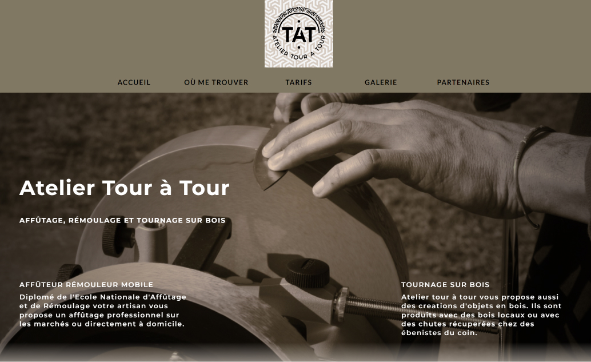

# Atelier Tour à Tour

This website was coded for a friend who is starting a business, i decided to use react, sass for the front-end, as it would help me strengthen the use of these languages.

the backend is on it's way, using node js, express and mongo db, considering using the cloudinary tools to manage the gallery

## Table of contents

- [Overview](#overview)
  - [The challenge](#the-challenge)
  - [Screenshot](#screenshot)
  - [Links](#links)
- [My process](#my-process)
  - [Built with](#built-with)
  - [Continued development](#continued-development)
- [Author](#author)

## Overview

### Screenshot

### Links

- Live Site URL: [Atelier Tour à Tour](https://www.ateliertouratour.fr)

## My process

### Built with

- HTML
- CSS / SASS
- REACT

### Continued development

#### Frontend

In the frontend, the focus is on enhancing user experience through animations to imbue the site with vitality. Additionally, I aim to develop a user interface to facilitate login functionality for my colleague. This interface will empower them to modify site content and upload images seamlessly.

#### Backend

The backend will utilize Node.js, Express, and MongoDB to manage data efficiently. Additionally, I'm exploring the integration of Cloudinary to handle the image gallery effectively. This setup will ensure robust functionality and scalability for the project.

## Author

- Website - [hregniez.com](https://www.hregniez.com)
- LinkedIn - [Henri Regniez](https://www.linkedin.com/in/henri-regniez/)

